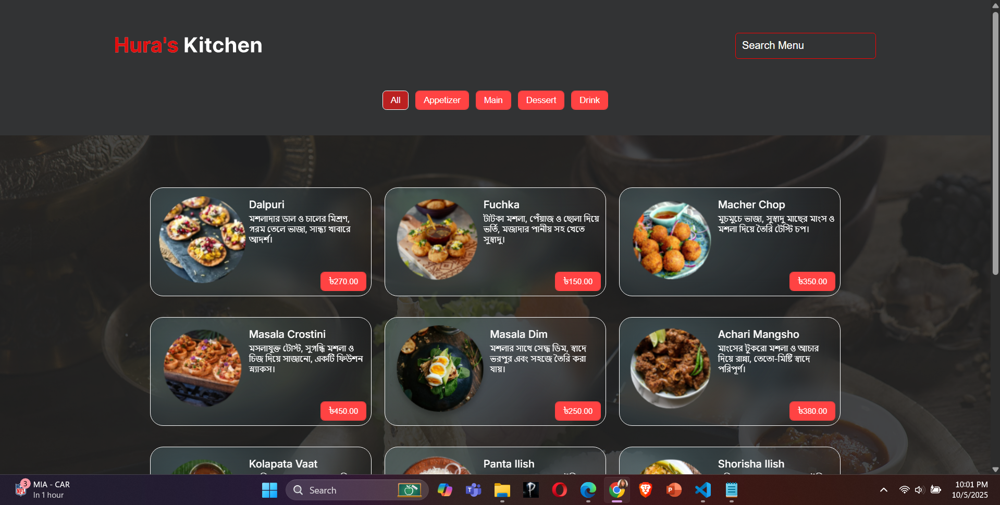
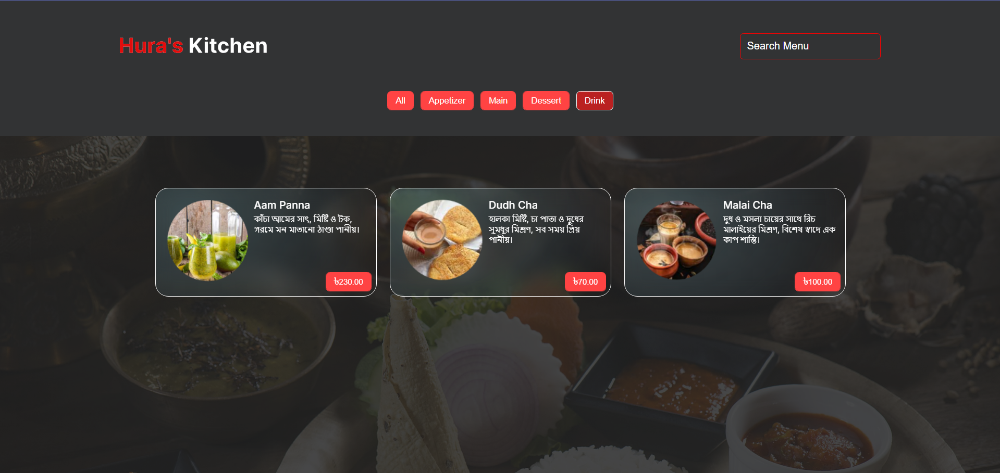
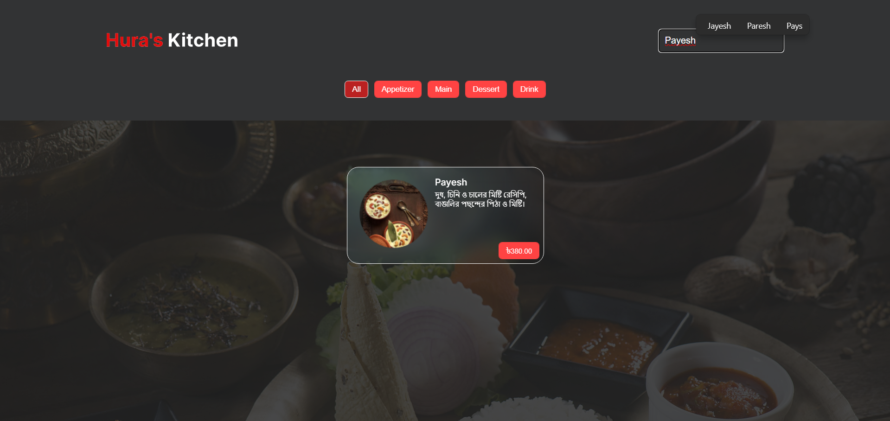

# Hura's Kitchen

Welcome to **Hura's Kitchen**, a restaurant food menu application built with **React.js**. This web application allows users to explore a variety of food items, filter them by category, and search for specific dishes using a search bar.

## Features

- **Food Menu Display**: Users can see a list of food items with images and prices.
- **Category Filter**: Filters to display food items based on the category (e.g., Appetizers, Main, Dessert, Drink).
- **Search**: A search bar allows users to quickly find food items by name.
- **Responsive Design**: The app is designed to be mobile-friendly, providing a smooth experience on various devices.

## Screenshots

### Home Page (Food Menu)


### Filter with Category


### Menu Search Option


## Installation

1. **Clone the repository**:
   ```bash
   git clone https://github.com/mashfi40/Huras-Kitchen.git
2. **Install the dependencies**:   
   ```bash
   npm install
   
Feel free to fork this repository and make contributions or suggestions. Enjoy using Hura's Kitchen!   

## Running the App and Server
To run both the client-side React app and the server in development mode, follow these steps:

1. **Start the server (backend) in one terminal**:
   ```bash
   npm run server
This will start the server on a separate port (e.g., localhost:9000).

2. **Start the React app (frontend) in another terminal**:
   ```bash
   npm run server


